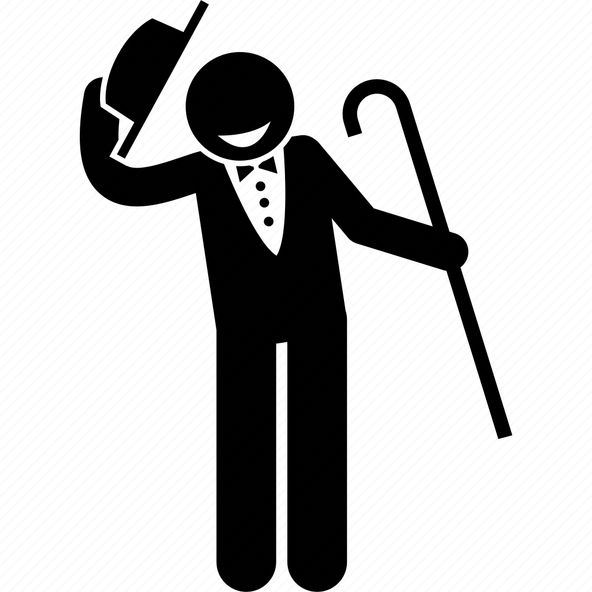

[<--- к содержанию](./readme.md)

# Заключительное слово

### Итак, чтобы хотелось сказать, в заключении. Наверное, это мое самое долгое практическое задание, за всю мою жизнь. Может, для кого то это покажется легкой преградой на пути величия web-разработчика, но как по мне, есть одна единственная сложность, которая исправно потрепала мне нервы и в тоже время зажгла азарт - это когда у тебя куча идей, но мало знаний и ~~навыков~~ умений воплотить то, что задумано буйной головой, под эффектом "музы любого программиста".

